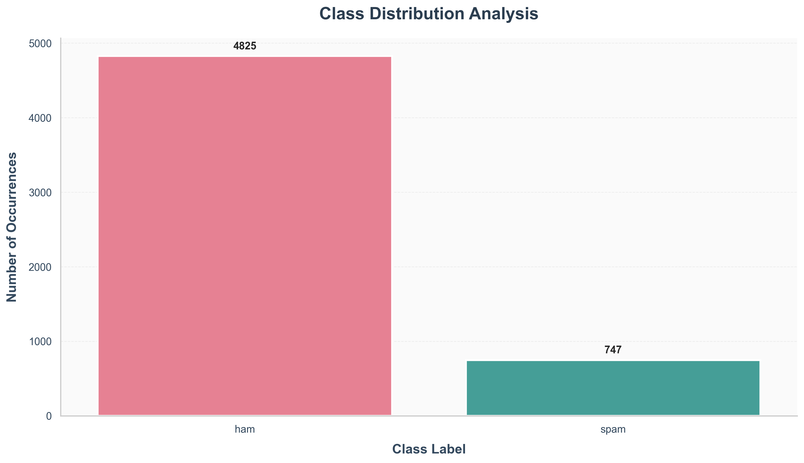
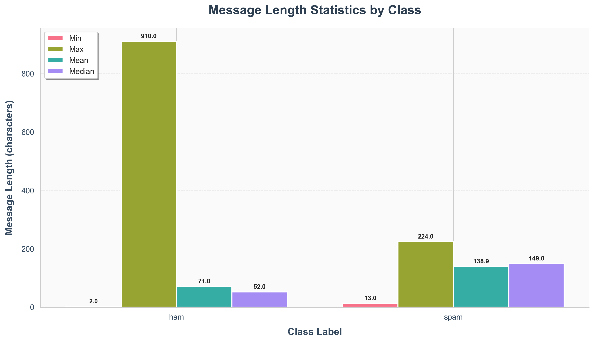
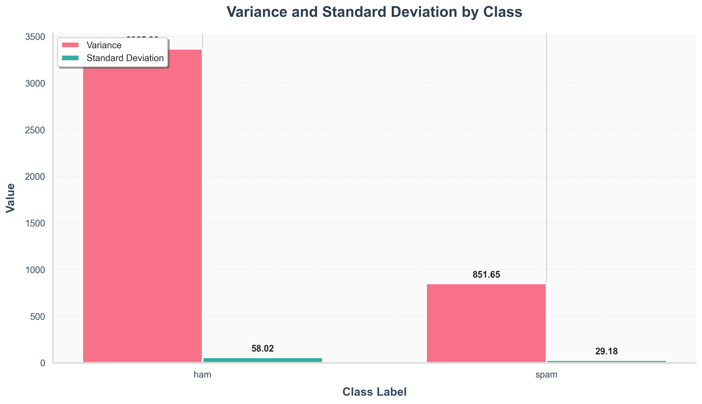
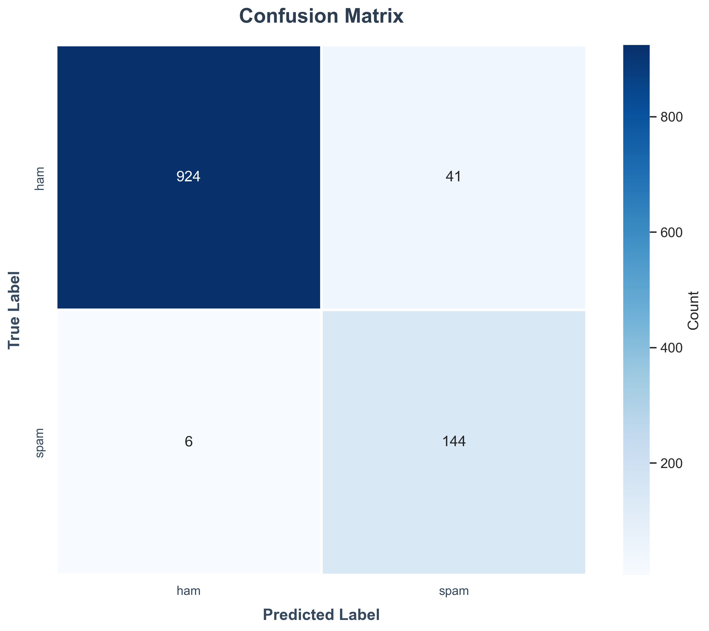
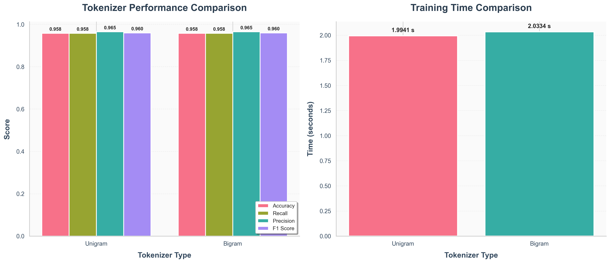

# Naive Bayes Classifier - SMS Spam Detection

A from-scratch implementation of a Naive Bayes classifier for binary text classification, specifically designed to detect spam messages in SMS data. This project demonstrates the mathematical foundations and practical applications of probabilistic machine learning.

## Overview

This project implements a **Multinomial Naive Bayes classifier** with Laplace smoothing to classify SMS messages as either "spam" or "ham" (legitimate messages). The implementation is built entirely from scratch using Python, without relying on scikit-learn's classifier implementations.

## Features

- **Custom Naive Bayes Implementation**: Built from the ground up with configurable smoothing parameters
- **Flexible Tokenization**: Support for both Unigram and Bigram tokenization strategies
- **Data Pipeline Architecture**: Modular pipeline for data fetching, transformation, and export
- **Laplace Smoothing**: Handles unseen vocabulary with configurable smoothing parameters
- **High Performance**: Achieves ~96% accuracy on the UCI SMS Spam Collection dataset
- **Log Probability Computation**: Uses log probabilities to prevent numerical underflow

## Dataset

The project uses the **UCI SMS Spam Collection Dataset** containing 5,572 SMS messages:
- **Ham (legitimate)**: 4,825 messages (86.6%)
- **Spam**: 747 messages (13.4%)



### Dataset Statistics

The analysis reveals distinct characteristics between spam and ham messages:



**Key Observations:**
- **Ham messages**: Average length of 71 characters (median: 52), with maximum reaching 910 characters
- **Spam messages**: Average length of 139 characters (median: 149), with maximum at 224 characters
- Spam messages tend to be longer and more consistent in length



**Variance Insights:**
- Ham messages show higher variance (3,365.65) with standard deviation of 58.02
- Spam messages have lower variance (851.65) with standard deviation of 29.18
- This indicates spam messages are more uniform in structure

## Implementation Details

### Architecture

The classifier implementation ([classifier.py](classifier.py:1)) consists of:

1. **ClassifierNB**: Main classifier class with the following components:
   - Histogram-based word frequency tracking per class
   - Prior probability calculation for each class
   - Conditional probability computation with smoothing
   - Log-probability prediction to prevent underflow

2. **Tokenization Module** ([Token/tokenization.py](Token/tokenization.py:1)):
   - `UnigramTokenization`: Splits text into individual words
   - `BigramTokenization`: Creates word pairs for context-aware features

3. **Data Pipeline** ([Pipe/pipeline.py](Pipe/pipeline.py:1)):
   - Modular architecture with fetch, transform, and export stages
   - Integration with Kaggle datasets
   - Text preprocessing and cleaning

### Key Algorithm Components

**Training Phase** ([classifier.py:53](classifier.py#L53)):
```python
def fit(self, X: typing.List, y: typing.List) -> None:
    # Builds histogram of word frequencies per class
    # Calculates prior probabilities P(class)
    # Updates vocabulary set
```

**Prediction Phase** ([classifier.py:80](classifier.py#L80)):
```python
def predict(self, X: typing.List[str]) -> typing.Dict[str, float]:
    # Computes log P(class|document) for each class
    # Returns dictionary of log probabilities
```

**Conditional Probability with Laplace Smoothing** ([classifier.py:33](classifier.py#L33)):
```
P(word|class) = (count(word, class) + α) / (total_words_in_class + α × |vocabulary|)
```
Where α is the smoothing parameter (default: 1.0)

## Experimental Results

### Model Performance

The classifier achieves excellent results on the test set:



**Performance Metrics:**
- **Accuracy**: ~96.0%
- **Precision**: ~96.5%
- **Recall**: ~96.0%
- **F1-Score**: ~96.0%

**Confusion Matrix Analysis:**
- True Negatives (Ham correctly classified): 924
- True Positives (Spam correctly classified): 144
- False Positives (Ham misclassified as Spam): 41
- False Negatives (Spam misclassified as Ham): 6

### Tokenizer Comparison



**Findings:**
- **Unigram Tokenization**:
  - Accuracy: 95.8%
  - Training time: 1.99 seconds
  - Simpler, faster, nearly identical performance

- **Bigram Tokenization**:
  - Accuracy: 96.5%
  - Training time: 2.03 seconds
  - Slightly better performance but slower
  - Captures word context and phrases

Both tokenizers achieve similar performance, with bigrams offering marginal improvement at the cost of increased computational time.

## Usage

### Basic Example

```python
from classifier import ClassifierNB
from Token.tokenization import UnigramTokenization
from sklearn.model_selection import train_test_split

# Prepare your data (X = list of tokenized messages, y = labels)
X_train, X_test, y_train, y_test = train_test_split(X, y, test_size=0.2)

# Initialize and train classifier
classifier = ClassifierNB(
    tokenizer=UnigramTokenization,
    smoothing_parameter=1.0
)
classifier.fit(X_train, y_train)

# Make predictions
predictions = classifier.predict(X_test[0])
print(predictions)  # {'ham': -45.2, 'spam': -52.1}
```

## Project Structure

```
NaiveBayes/
├── classifier.py              # Naive Bayes classifier implementation
├── main.py                    # Main execution script
├── Token/
│   └── tokenization.py       # Tokenization strategies
├── Pipe/
│   ├── pipeline.py           # Data pipeline protocols
│   └── kagglehub_pipeline.py # Kaggle dataset integration
├── Images/
│   ├── plot_distributions.py
│   ├── plot_math_statistics.py
│   ├── plot_experiments.py
│   └── Photos/               # Generated plots and visualizations
└── requirements.txt
```

## Mathematical Foundation

The Naive Bayes classifier is based on Bayes' Theorem:

```
P(class|document) = P(document|class) × P(class) / P(document)
```

With the "naive" independence assumption:

```
P(document|class) = ∏ P(word_i|class)
```

Using log probabilities to prevent underflow:

```
log P(class|document) = log P(class) + ∑ log P(word_i|class)
```
